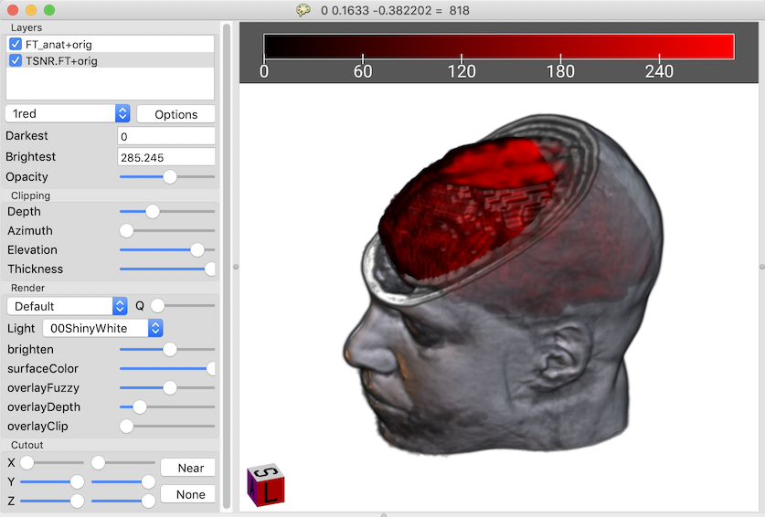
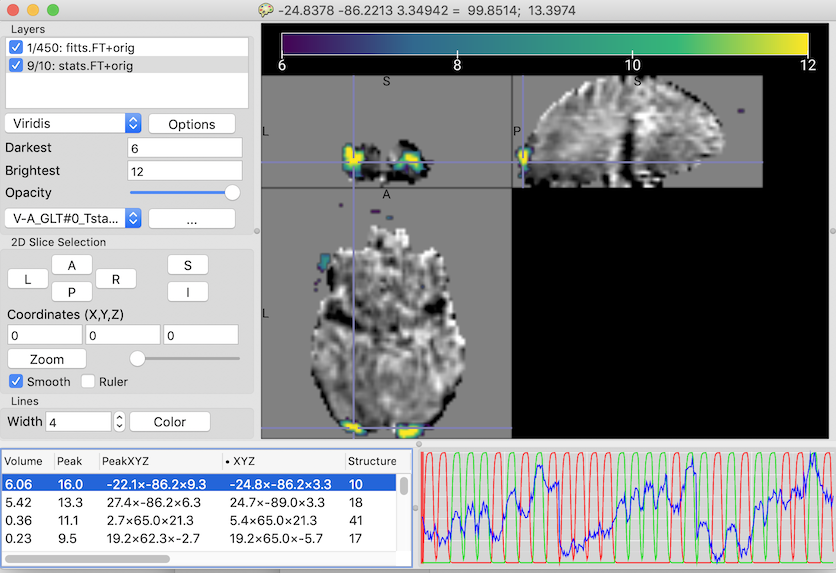
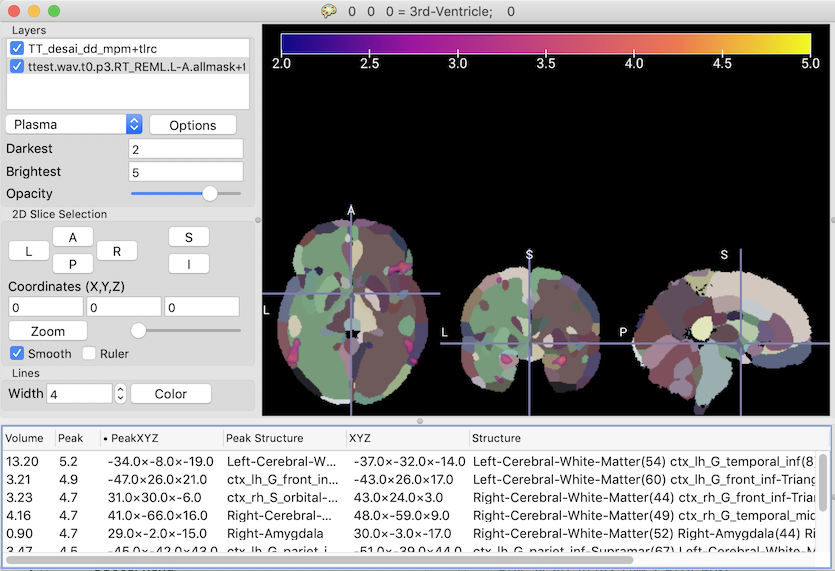

## About

This is a developmental version of [MRIcroGL](https://www.nitrc.org/plugins/mwiki/index.php/mricrogl:MainPage) that improves support for [AFNI (Analysis of Functional NeuroImages)](https://afni.nimh.nih.gov). While both MRIcroGL and AFNI can support popular image formats like NIfTI, AFNI has leverages custom formats (e.g. HEAD and 1D) for advanced features. This repository describes an upcoming release of MRIcroGL that exploits these formats.

## Requirements

MRIcroGL requires [OpenGL 3.3](https://www.mccauslandcenter.sc.edu/mricrogl/troubleshooting) (released in 2009) or later. MRIcroGL is provided for Linux, MacOS and Windows computers.

## Installation

You can get the experimental beta release of MRIcroGL (1.2.20191031) from [the Github release page](https://github.com/neurolabusc/MRIcroGL_AFNI/releases), or run one of the following commands to get the development version of MRIcroGL for Linux, Macintosh or Windows: 

   * `curl -fLO https://github.com/neurolabusc/MRIcroGL_AFNI/releases/latest/download/MRIcroGL_linux.zip`
   * `curl -fLO https://github.com/neurolabusc/MRIcroGL_AFNI/releases/latest/download/MRIcroGL_macOS.dmg`
   * `curl -fLO https://github.com/neurolabusc/MRIcroGL_AFNI/releases/latest/download/MRIcroGL_windows.zip`
   
The tutorial described below uses sample data, which you can download from the [release page](https://github.com/neurolabusc/MRIcroGL_AFNI/releases) or with this command:
   
   * `curl -fLO https://github.com/neurolabusc/MRIcroGL_AFNI/releases/latest/download/SampleDataset.zip`

Alternatively, you can download the [raw data](https://afni.nimh.nih.gov/pub/dist/edu/data/CD.expanded/AFNI_data6/unix_tutorial/misc/install.data.html) used for the sample dataset. The raw dataset includes instructions for processing this data (in the FT_analysis/tutorial folder).

## Opening Overlays

AFNI leverages .HEAD format images. MRIcroGL allows you to view these by using drag-drop, menus (e.g. File/Open), and Python scripting. If it detects that AFNI is installed, it will populate a menu File/OpenAFNI that provides quick access to the default AFNI images.

The image below can be generated from the [sample images](https://github.com/neurolabusc/MRIcroGL_AFNI/releases) and shows how you can check the registration of the high-resolution T1 scan and the T2* BOLD sequence. 
 - Select File/Open and choose the anatomical scan.
 - Select File/AddOverlay and choose the functional scan.
 - In the 'Overlay' panel adjust the Opacity slider to make the overlay translucent.
 - The Color/BackColor menu allows you to change the background color, for example making it white.
 - Choose Display/Render to show a rendering.
 - The rendering shows some noise in the air around the T1 scan, choose View/RemoveHaze to create a nicer rendering.
 - You can use the clipping menu to hide parts of the T1 scan.
 
You can also achieve the same results using the in-built Python scripting. Choose Scripting/New to show the scripting panel. Paste the code below - you will want to edit the `pth` to be the path where your images are stored (on Windows, it will be something like `pth = 'C:/afni/'`, note the `/` not `\` for path separators as Python uses `\` for special characters). Choosing Scripting/Run to execute the script.


```
import gl
gl.resetdefaults()
pth = '~/afni/'
gl.loadimage(pth+'FT_anat+orig.HEAD')
gl.overlayload('TSNR.FT+orig.HEAD')
gl.opacity(1, 50)
gl.backcolor(255,255,255)
gl.extract()
gl.clipazimuthelevation(0.3, 0, 120)
```



## Viewing 4D Time Series

AFNI stores fMRI and resting-state images as a single 4D image, with each 3D volume showing a different moment in the scan. AFNI also uses 4D files to store statistical maps, for example in the tutorial we analyzed data where an individual completes both visual and auditory tasks and we conduct multiple contrasts: which areas areas active during the visual task, which regions are involved with the auditory tast and which regions are more activated during vision than hearing. All of these contrasts are stored in a single convenient file. In addition, AFNI generates spreadsheets saved as text files (with the extension .1D) that show changes across time. For example, in the tutorial the file 'ideal_Vrel.1D' shows the expected hemodynamic response to visual stimuli.

To view these datasets:
 - Use File/Open to select the 4D fMRI data (e.g. `fitts.FT+orig.HEAD`). Note an interactive graph appears at the bottom showing activity at the selected voxel across time.
 - Select File/AddOverlay to load our statistical map `stats.FT+orig.HEAD`. 
 - Note that the Layers panel reveals that the statistical map has 10 distinct volumes. Choose the 9th volume (`V-A_GLT#0_Tstat`) from the pull-down menu.
 - In the Layers panel set the `Darkest` and `Brightest` range of the overlay to be 6 and 12, this hides noisy voxels with T-scores less than 6.
 - In the Layers panel, choose `Viridis` from the pull-down menu to change the color scheme for the overlay.
 - Press the `Options` button in the Layers panel and select `Generate Cluster Table`. An interactive list appears at the bottom of the screen that allows you to select clusters. Note you can click on the top of the list to sort by cluster volume or peak height.
 - Choose Graph/Open and select the file `ideal_Arel.1D`: note that the bottom graph panel now shows expected responses for the auditory stimuli.
 - Choose Graph/Add and select the file `ideal_Vrel.1D`. 
 - As you click on different clusters, you can see how well the observed data match the ideal responses.

Here is a script to achieve the same results:

```
import gl
gl.resetdefaults()
pth = '~/afni/'
gl.loadimage(pth+'fitts.FT+orig.HEAD')
gl.overlayload(pth+'stats.FT+orig.HEAD')
gl.loadgraph(pth+'ideal_Arel.1D', 0)
gl.loadgraph(pth+'ideal_Vrel.1D', 1)
gl.graphscaling(3)
gl.volume(1,8)
gl.minmax(1, 6, 12)
gl.colorname(1,'Viridis')
gl.generateclusters(1)
gl.orthoviewmm(0,0,0)
```



## Using Templates

AFNI includes a series of atlases that parcellate the brain into distinct regions. MRIcroGL is able to show the region names and also use these tables to create named maps for brain regions.

To view a template:
 - Select File/OpenAFNI and select the atlas `TT_desai_dd_mpm+tlrc.HEAD`.
 - Note clicking at different locations shows the name of the selected region in the title bar. Also, a cluster-table appears at the bottom - clicking a row selects the center of the selected region (you can click along the top row to sort by volume or region name).
 - In the Layers panel set the `Darkest` and `Brightest` range of the overlay to be 0 and 20 - this reduces the color saturation of the template to 20%, making it easier to see overlays.
 - Choose File/AddOverlay to select the group statistics file `ttest.wav.t0.p3.RT_REML.L-A.allmask+tlrc.HEAD`.
 - In the Layers panel set the `Darkest` and `Brightest` range of the overlay to be 1 and 5. This helps show intensity variation in this map (and also influences the subsequent cluster generation).
 - Press the `Options` button in the Layers panel and select `Generate Cluster Table`. An interactive list appears at the bottom of the screen that allows you to select clusters. Since we have an Atlas open, this table lists the structures related to each peak. It also provides a listing of the proportion of structures involved with each cluster. So a cluster that is 90% one region and 10% another might read `Left-Cerebral-White-Matter(90) ctx_lh_G_temporal_inf(10)`.
 - You can choose Display/Render to show a surface rendering. From the Render panel's pull-down menu I like to select the `Tomography` shader for atlases.

Here is a script to achieve the same results:

```
import gl
gl.resetdefaults()
pth = '~/afni/'
#the desai atlas comes with AFNI
# if this fails, use File/OpenAFNI to set AFNI folder
gl.loadimage('TT_desai_dd_mpm+tlrc.HEAD')
#set atlas saturation to 20%
gl.minmax(0, 0, 20)
gl.overlayload(pth+'ttest.wav.t0.p3.RT_REML.L-A.allmask+tlrc.HEAD')
gl.minmax(1, 2, 5)
gl.colorname(1,'Plasma')
#make overlay translucent
gl.opacity(1, 75)
#find clusters
gl.generateclusters(1)
gl.orthoviewmm(0,0,0)
#the 'tomography' shader works well with discrete atlases
gl.shadername('Tomography')
```



## Additional Information

This is a developmental release of MRIcroGL. Below are links for reporting issues, getting help and reading more about MRIcroGL.

 - The [GitHub page](https://github.com/rordenlab/MRIcroGL12) allows you to report issues.
 - The [Wiki](https://www.nitrc.org/plugins/mwiki/index.php/mricrogl:MainPage) provides advice and troubleshooting.
 - The [Forums](https://www.nitrc.org/forum/?group_id=889) allow you to request help.
